# NovaCommerce (Flutter + Firebase) — Portfolio Project


NovaCommerce is a **portfolio-grade Flutter e-commerce MVP** featuring:
- a modern storefront UX (browse → details → variants → cart → checkout),
- a **Nova AI** chat-style assistant experience,
- and a **Firebase backend** (Firestore + Auth) with **transactional checkout**.

> **Portfolio note:** This repository is shared for evaluation/review of engineering work.  
> See the **License** section below for usage restrictions.

---

## Highlights

- **Feature-first structure** with clean layering (domain / data / presentation)
- **Riverpod** state management (ViewModels via StateNotifier)
- **GoRouter ShellRoute** app shell (tabs + nested routes)
- **Firestore-backed catalog + orders**
- **Transactional checkout** (validates + decrements variant stock atomically)
- **Wishlist + Cart persistence**
- **Auth**: Anonymous, Email/Password, Google
- **Performance work**: paging, cached images, reduced rebuilds, skeleton loaders
- **Defensive UI**: overflow-safe cards, consistent error mapping, retry states

---

## Screenshots

<div>
  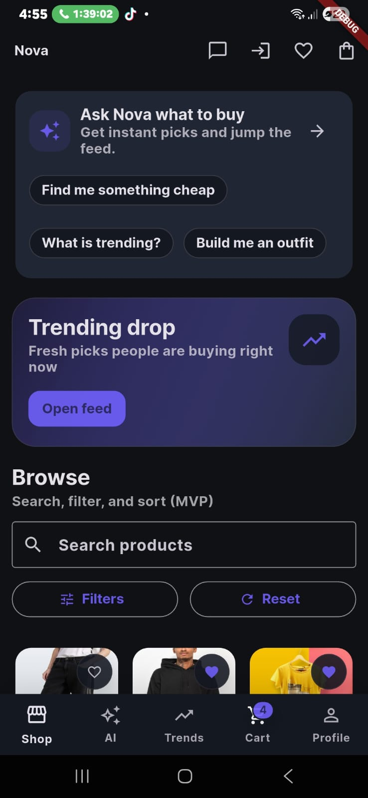
  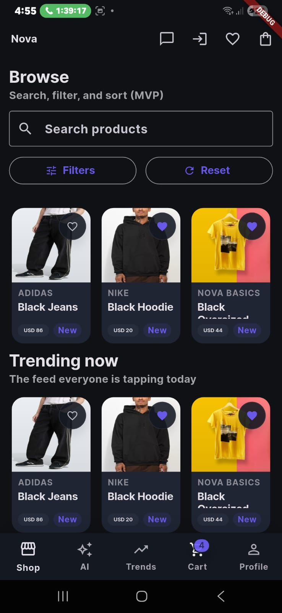
</div>

<div>
  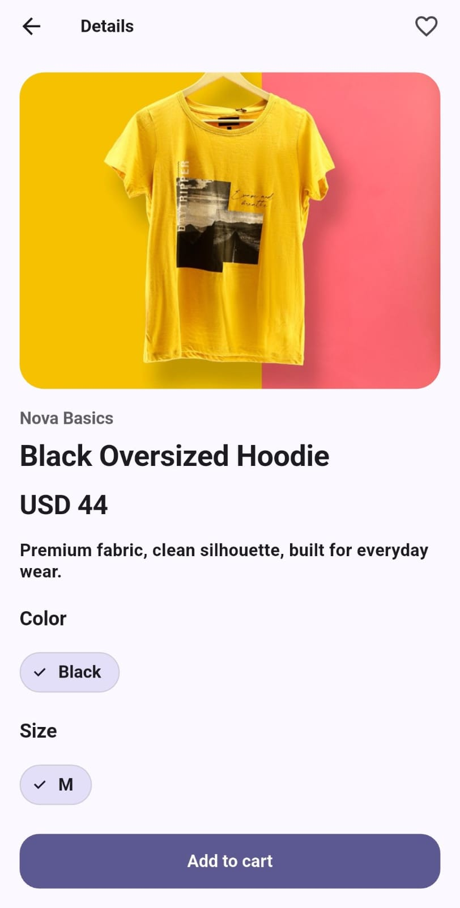
  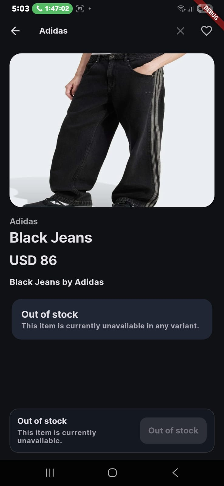
</div>

<div>
  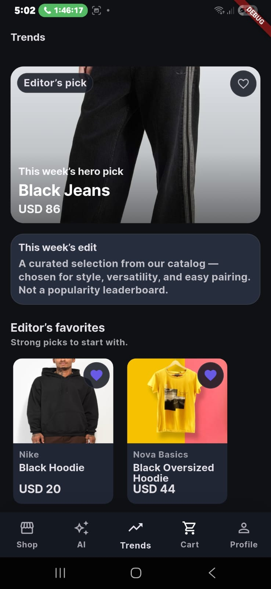
  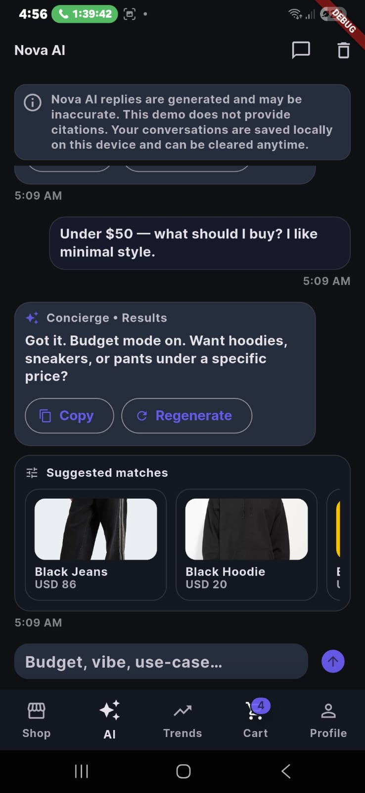
</div>

<div>
  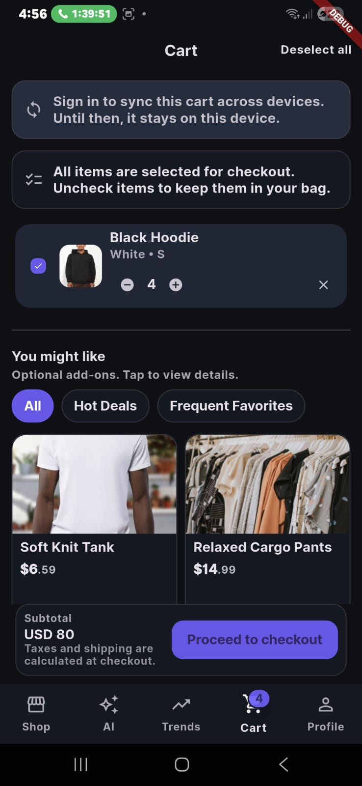
  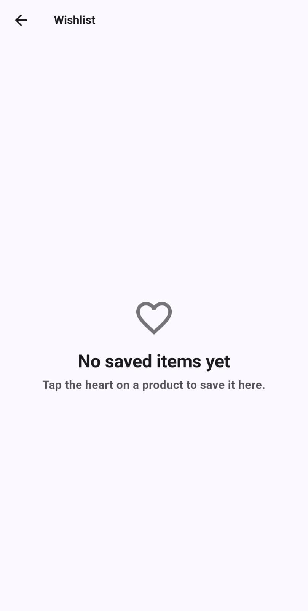
</div>

<div>
  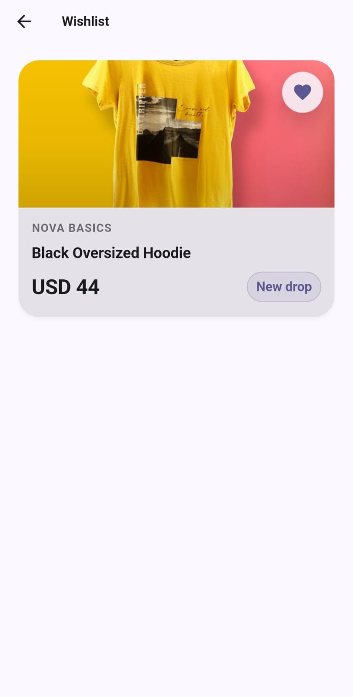
  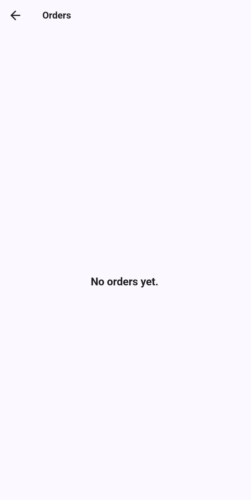
</div>

<div>
  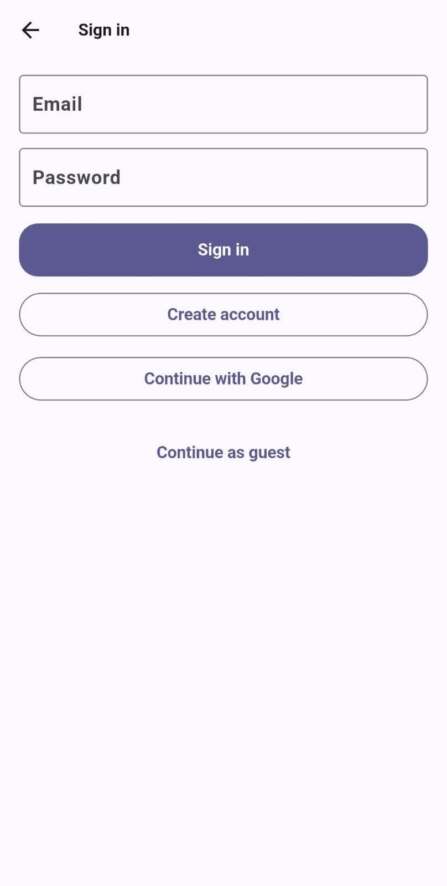
</div>

---

## Tech Stack

- **Flutter / Dart**
- **Material 3**
- **Riverpod 2.x**
- **GoRouter**
- **Firebase**: Firestore, Firebase Auth
- **cached_network_image**
- **flutter_screenutil** (responsive sizing)

---

## Project Structure (high level)

```
lib/
  app.dart
  main.dart
  core/          # routing, theme, widgets, config, error mapping
  domain/        # entities + repository interfaces
  data/          # repos + datasources (Firestore/SharedPrefs/etc.)
  features/      # home, product, cart, checkout, wishlist, orders, auth, ai_assistant, profile
```

---

## Getting Started

### 1) Install dependencies

```bash
flutter pub get
```

### 2) Run code quality checks

```bash
dart format .
flutter analyze
flutter test
```

> **Note:** Golden tests are skipped on Windows due to Flutter tool temp cleanup flakiness.
> They run in CI and on non-Windows environments.

### Testing (tagged)

```bash
# Non-golden tests (all platforms)
flutter test --exclude-tags=golden

# Golden tests (CI / non-Windows)
flutter test --tags=golden
```

### 3) Run the app

```bash
flutter run
```

---

## Firebase Setup

This app expects Firebase config generated by **FlutterFire**.

### Option A — Use your own Firebase project (recommended)

1. Create a Firebase project in the Firebase console.
2. Enable **Authentication** providers (Anonymous / Email-Password / Google).
3. Create Firestore collections:
   - `products` (catalog)
   - `orders` (created by checkout)
4. From your repo root:

```bash
flutterfire configure
```

This will generate platform config, including:
- `android/app/google-services.json`
- `ios/Runner/GoogleService-Info.plist`
- `lib/firebase_options.dart`

> **Tip:** Make sure each product document contains `featured: true` and a `createdAt` timestamp if your query orders by it.

---

## Firestore Emulator (optional)

Run the emulator:

```bash
firebase emulators:start --only firestore,auth
```

Run the app pointing to emulators:

```bash
flutter run   --dart-define=USE_FIRESTORE_EMULATOR=true   --dart-define=FIRESTORE_HOST=localhost   --dart-define=FIRESTORE_PORT=8080   --dart-define=AUTH_PORT=9099
```

Android emulator note: `localhost` is automatically mapped to `10.0.2.2`.

---

## Demo / Offline Mode

Run with in-memory repositories (no Firebase needed):

```bash
flutter run --dart-define=USE_FAKE_REPOS=true
```

---

## Security + License (Important)

This repository is provided for **portfolio review**.  
It is **not** open-source. **No commercial use, redistribution, or deployment** is allowed.

See [LICENSE](LICENSE).

---

## Contact

If you’d like a walkthrough (architecture, tradeoffs, performance decisions), feel free to reach out.
