# Nova Commerce

A production-ready mobile commerce application built with Flutter and Firebase, featuring a modern shopping experience, real-time backend integration, and a scalable architecture suitable for real-world use.

Nova Commerce demonstrates end-to-end product discovery, cart management, checkout, order tracking, authentication, and AI-assisted shopping, implemented with performance, reliability, and maintainability in mind.

---

## Features

### Core Commerce
- Product catalog with featured products and pagination
- Product variants (size, color) with stock validation
- Cart with quantity management and persistence
- Wishlist with local + remote sync
- Secure checkout flow with transactional stock updates
- Orders history and order details

### Authentication
- Email & password authentication
- Google sign-in
- Anonymous (guest) sessions with upgrade to authenticated accounts

### Backend & Data
- Firebase Firestore for products, orders, and user data
- Firestore transactions for atomic checkout and stock decrement
- Firebase Authentication integration
- Emulator support for local development
- Offline persistence enabled for Firestore

### UX & Performance
- Responsive layout using flutter_screenutil
- Optimized scrolling and rebuild minimization
- Cached network images with decode-size hints
- Skeleton loaders for perceived performance
- Consistent, user-friendly error handling
- Tested overflow-safe UI components

### AI Assistant
- Integrated AI chat assistant (Nova AI) for product-related queries
- Modular AI repository design (real or fake implementations)

---

## Screenshots

<p align="center">
  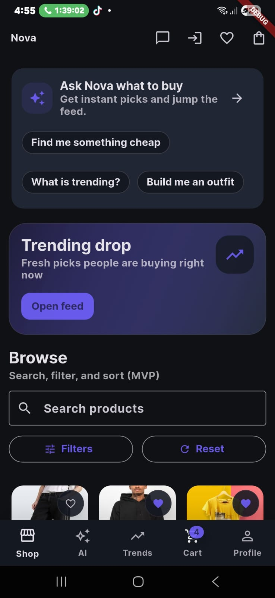
  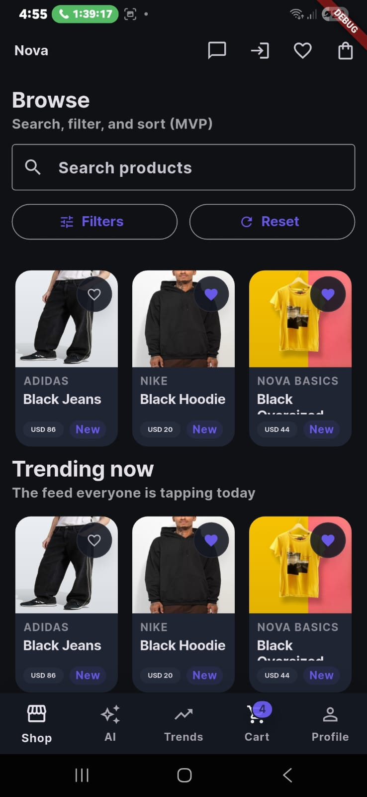
</p>
<p align="center">
  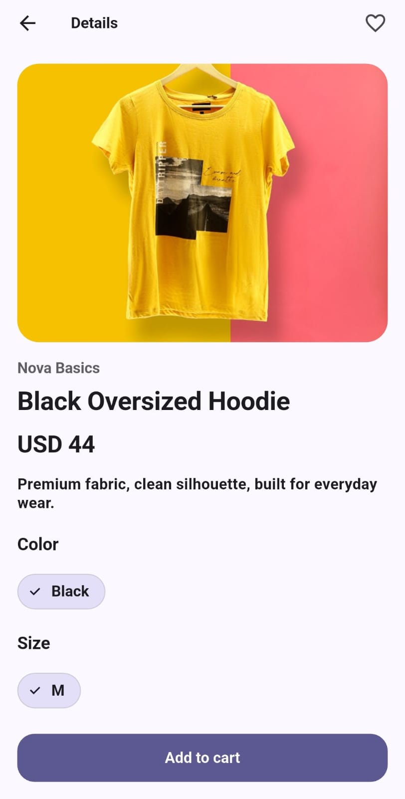
  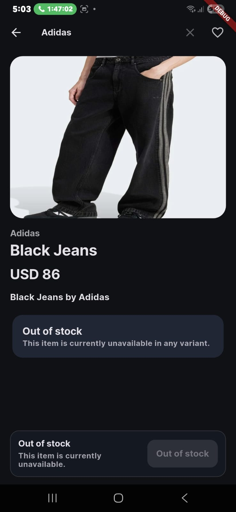
</p>
<p align="center">
  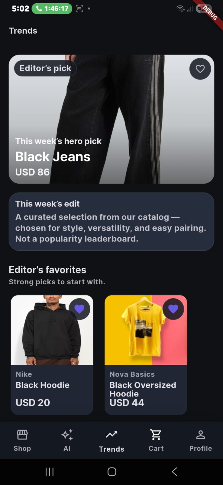
  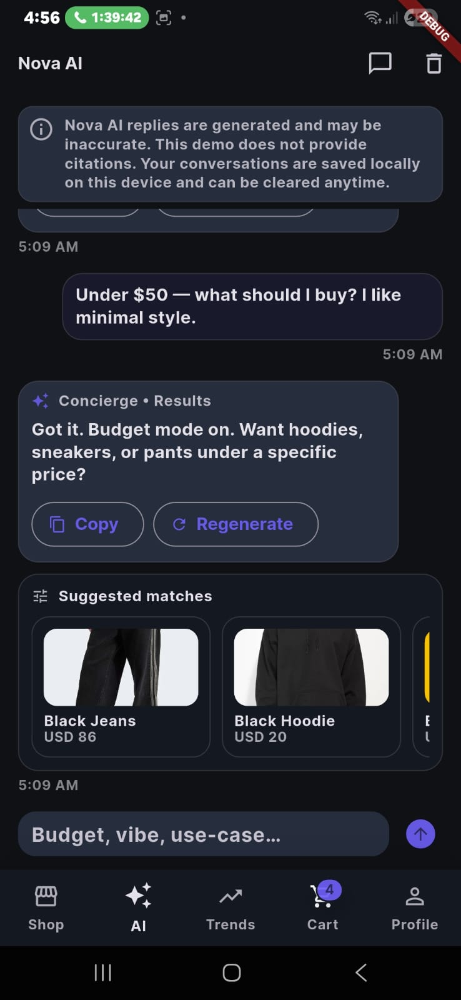
</p>
<p align="center">
  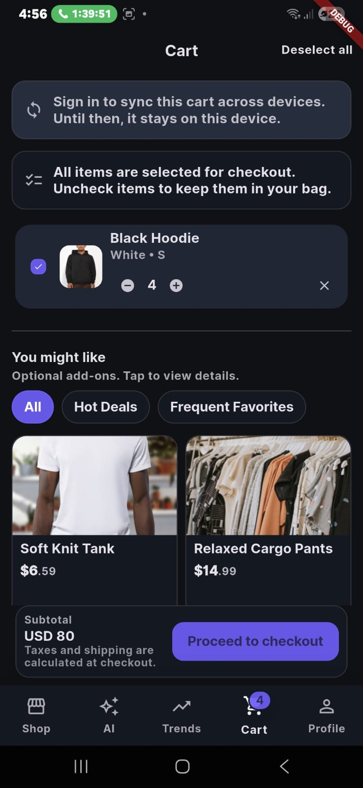
  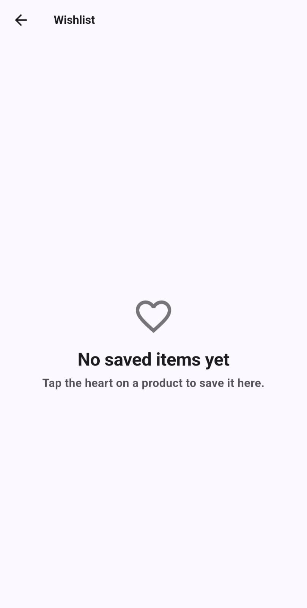
</p>
<p align="center">
  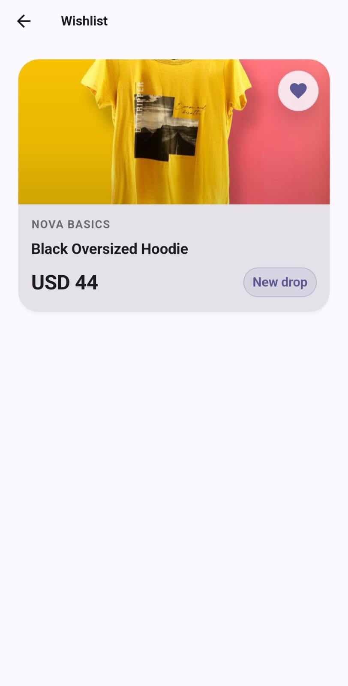
  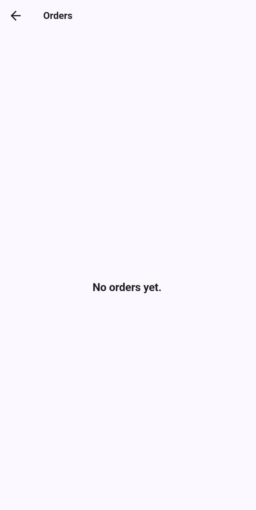
</p>
<p align="center">
  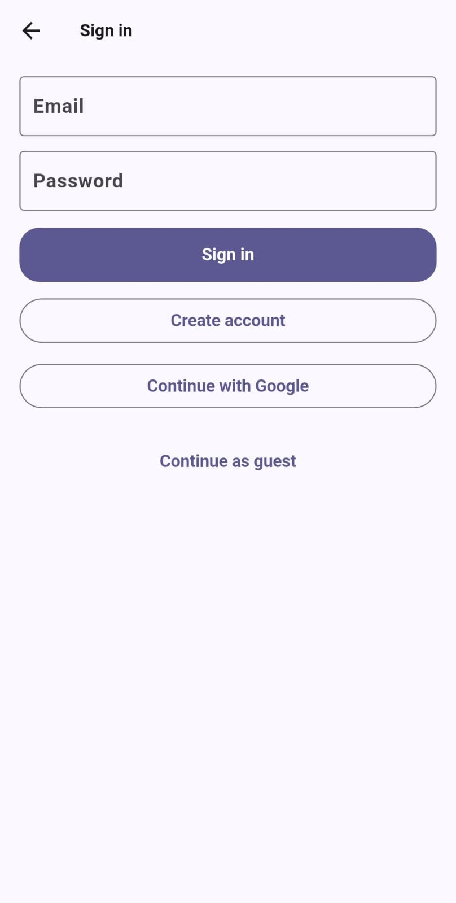
</p>

---

## Tech Stack

- Flutter (Material 3)
- Firebase (Firestore, Firebase Auth)
- Riverpod
- GoRouter
- SharedPreferences
- Cached Network Image
- Flutter ScreenUtil

---

## Getting Started

```bash
flutter pub get
flutterfire configure
flutter run
```

---

## Testing

```bash
dart format .
flutter analyze
flutter test
```

---

## License

MIT License
