# NovaCommerce


NovaCommerce is a mobile commerce portfolio project built with Flutter and Firebase-oriented architecture. It demonstrates production-style app structure for storefront browsing, product discovery, product details, cart, checkout, payments, orders, offers, loyalty, wishlist, profile, localization, performance tooling, UI systems, and demo AI surfaces.

This repository is designed for portfolio review and technical evaluation. It contains real Flutter app architecture, Firebase integration points, and Firebase Functions payment/order code, but it is not a finished production launch build or deployed ecommerce platform.

## Quick Reviewer Path

If you have five minutes, review the project in this order:

1. Run the app without Firebase:

```bash
flutter pub get
flutter run --dart-define=USE_FAKE_REPOS=true
```

2. Scan the app architecture:
   - [Project Structure](#project-structure)
   - [Architecture](#architecture)
   - [Firebase And Backend](#firebase-and-backend)
   - [Payments](#payments)
   - [AI Surfaces](#ai-surfaces)
   - [docs/ARCHITECTURE.md](docs/ARCHITECTURE.md)
   - [docs/BUILD_FLAVORS.md](docs/BUILD_FLAVORS.md)

3. Inspect the most relevant implementation entry points:
   - `lib/app/di/app_providers.dart` for Riverpod dependency boundaries and fake/Firebase repository switching.
   - `lib/app/router/app_router.dart` and `lib/app/router/app_routes.dart` for GoRouter tab shell and flow routing.
   - `lib/features/*` for feature-first presentation/domain/data modules.
   - `lib/features/payments/` and `functions/src/index.ts` for Stripe/Firebase Functions payment architecture.
   - `lib/l10n/`, `lib/gen_l10n/`, and `l10n.yaml` for localization.

4. Check screenshots in `assets/screenshots/`. They are current emulator captures covering storefront, search/discovery, Nova Concierge, offers, cart, account, Arabic RTL, French, and dark mode surfaces. They prove the app is not just scaffolding, while the timestamp filenames make clear they are captured artifacts rather than designed marketing images.

5. Treat integrations honestly:
   - Firebase-backed flows require a Firebase project, client config, data, auth providers, and security rule validation.
   - Stripe has client and Firebase Functions architecture, but real use requires deployed Functions, secrets, webhook setup, publishable key configuration, and Firestore/Auth validation.
   - PayPal is demo/stub behavior only.
   - Nova AI concierge is deterministic fake/demo behavior unless a real service is connected.
   - The TFLite AI navigation path is represented as local model/controller architecture, not a cloud AI product.

## Screenshots

Current screenshots are stored in `assets/screenshots/` and are included in `pubspec.yaml`.

<p align="center">
  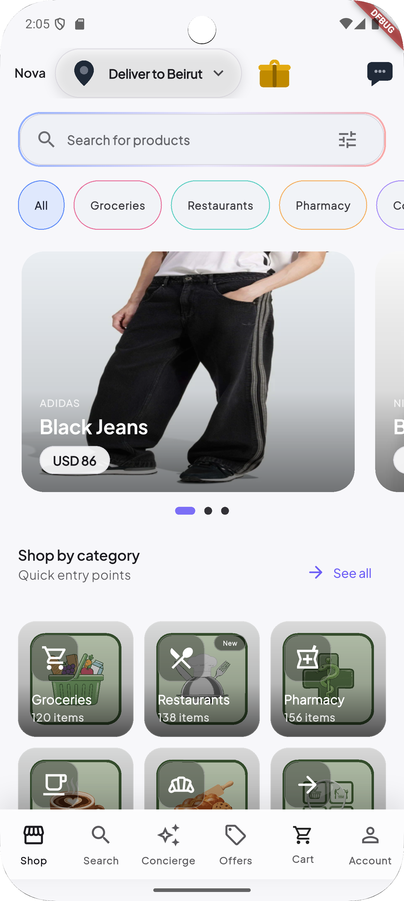
  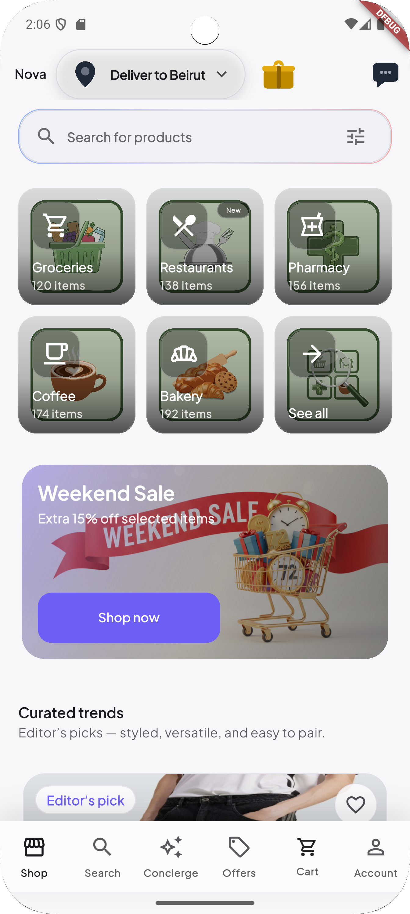
  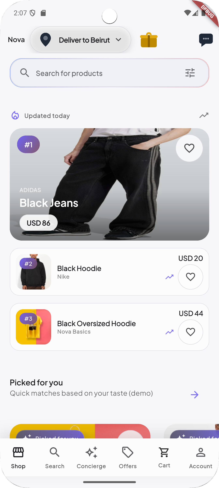
  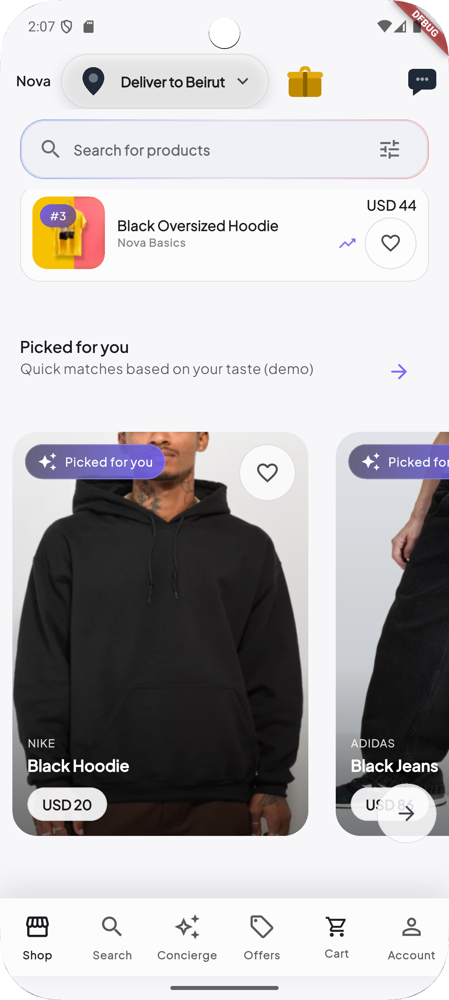
</p>

<p align="center">
  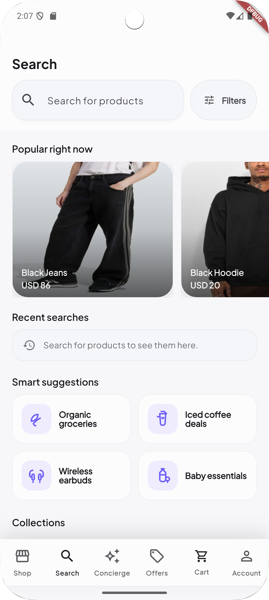
  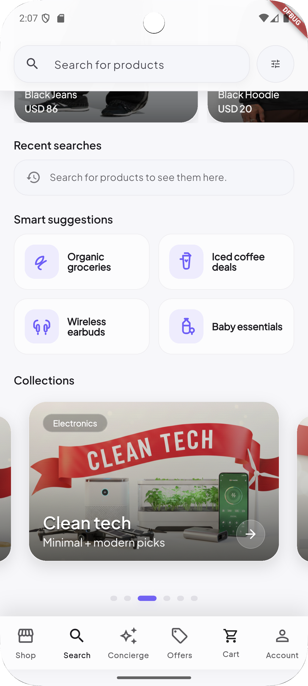
  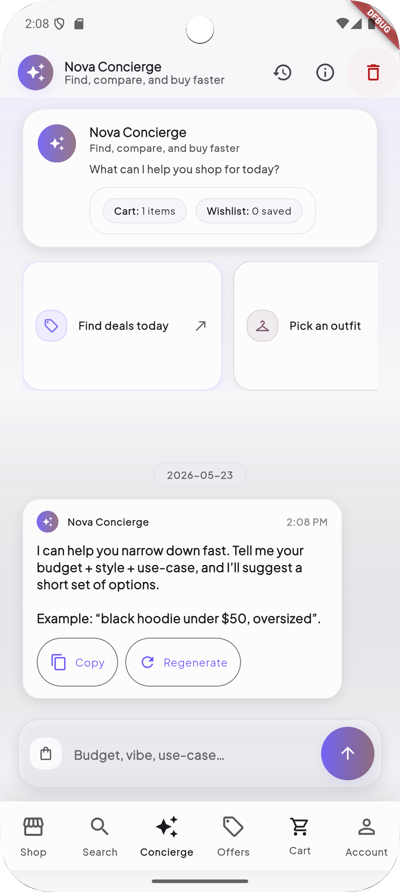
  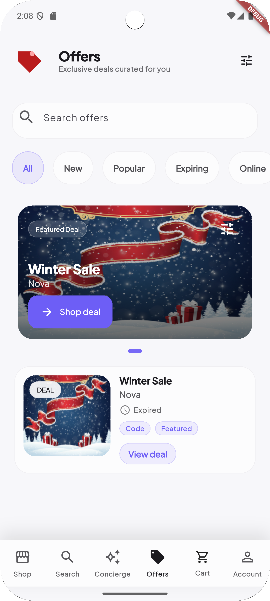
</p>

<p align="center">
  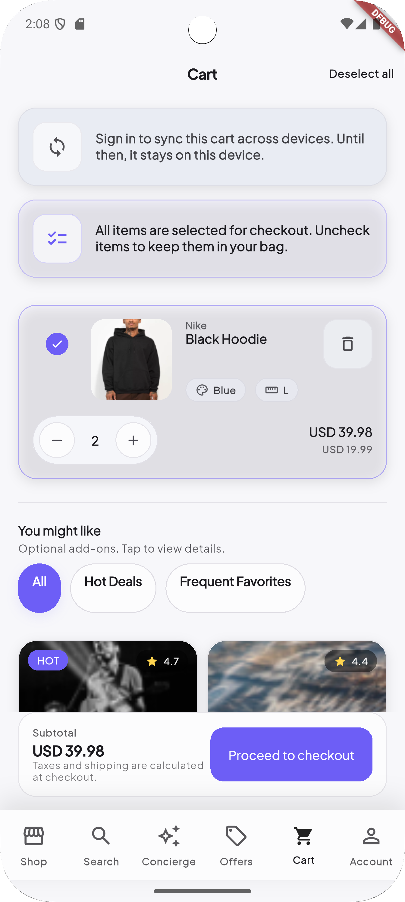
  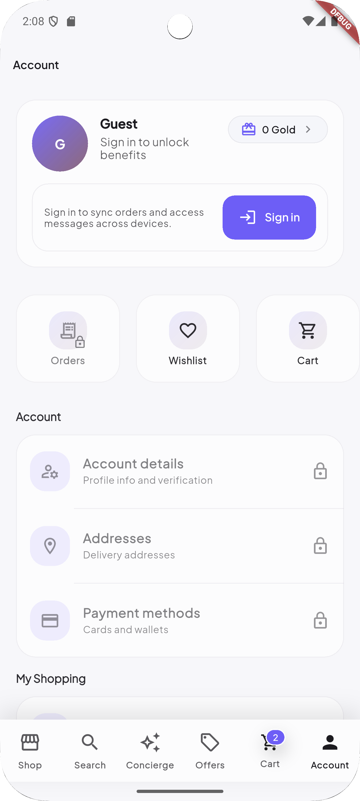
  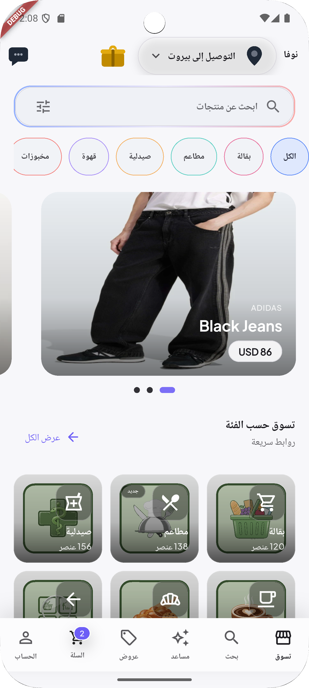
  
</p>

<p align="center">
  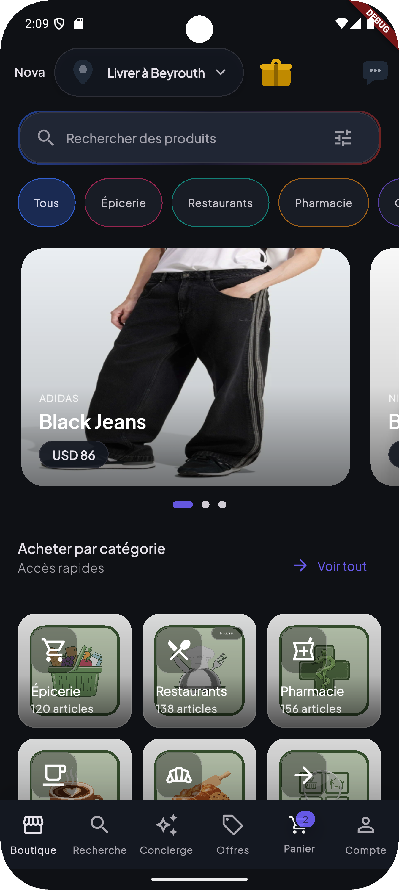
</p>

These captures show that the current demo UI covers storefront browsing, category/product discovery, search, AI concierge, offers, cart/checkout entry, account/profile, localization, RTL layout, and dark mode. They should be refreshed whenever the visual system changes materially.

## What This Project Proves

- Flutter mobile product architecture for a commerce app with multiple real user flows.
- Feature-first organization across `presentation`, `domain`, and `data` layers.
- Riverpod state management and dependency injection boundaries that swap fake/local/Firebase implementations.
- GoRouter navigation with tab shell structure and routed checkout, payment, product, profile, orders, offers, and loyalty flows.
- Firebase integration points for Auth, Firestore, Functions, emulator use, and Firestore rules.
- Demo/fake repository mode for technical review without Firebase setup.
- Ecommerce flows including storefront, product discovery, product details, cart, checkout, orders, wishlist, offers, and loyalty.
- Localization architecture using ARB sources for English, Arabic, French, and Spanish.
- Payment flow architecture with Stripe/Firebase Functions integration points and safe client/server separation.
- Honest handling of fake/demo AI surfaces through repository boundaries.
- Performance and resilience considerations such as cached images, decode-size policy, retry/empty states, pagination/deduping, performance markers, and profile tooling.

## Current Scope / Honest Limitations

- Firebase-backed flows require project-specific Firebase setup, generated platform config, seeded or real Firestore data, enabled auth providers, and rule validation.
- Stripe requires Firebase Functions deployment, Functions secrets, webhook endpoint setup, webhook secret validation, Stripe publishable key configuration, and Firestore/Auth validation.
- PayPal is represented as demo/stub behavior only; real PayPal checkout is not configured.
- Nova AI / AI concierge uses deterministic demo behavior unless a real AI service is connected behind the existing repository boundary.
- Production launch work is outside the current scope: final app identifiers, signing, privacy/legal pages, real catalog data, monitoring, refund/admin tooling, fulfillment operations, and broader operational setup are not completed here.
- Some routes and catalog-style entry points intentionally show placeholder or demo behavior while the architecture is being demonstrated.
- Android debug builds may show an NDK version recommendation related to `integration_test`; the current debug build still completes.

## Demo Mode

Demo mode uses fake/local repositories so reviewers can run the app without a Firebase project:

```bash
flutter pub get
flutter run --dart-define=USE_FAKE_REPOS=true
```

Useful demo/payment flags:

```bash
flutter run \
  --dart-define=USE_FAKE_REPOS=true \
  --dart-define=PAYMENTS_DEMO_OUTCOME=success
```

`PAYMENTS_DEMO_OUTCOME` also accepts failure-style values used by the fake payment repository, such as `failure` or `cancel`.

Verification commands used by this repo:

```bash
dart format --set-exit-if-changed .
flutter analyze
flutter test --exclude-tags=golden
flutter build apk --debug
```

Golden tests are excluded from the main non-golden test command until stable baselines are committed.

## Features

- Storefront-style home feed with curated sections, categories, search entry points, product cards, pull-to-refresh, and load-more behavior.
- Product discovery and search with filters, recent searches, collection surfaces, result cards, and empty/error states.
- Product details flow with image carousel, variants, stock-aware selection, wishlist action, description, and add-to-cart behavior.
- Cart with local persistence, selected-item checkout behavior, quantity updates, recommendations, and signed-in Firestore sync architecture.
- Checkout form with shipping details, phone normalization, selected cart summary, validation surfaces, and payment handoff.
- Payment method, payment confirmation, success, and failure screens.
- Orders list, order details, and order success surfaces.
- Offers module with search, filters, sorting, offer cards, detail pages, promo-code-oriented data, and fake/Firestore repository implementations.
- Gold loyalty screens with reward cards, points history, and reward detail surfaces.
- Wishlist, recently viewed, profile, account details, messages, trends, and AI concierge modules.
- Demo repository implementations for reviewing the app without a configured Firebase project.
- Localization files for English, Arabic, French, and Spanish.
- Performance markers, image cache policies, and profile-flow tooling.

## Architecture

NovaCommerce follows a feature-first Flutter structure with explicit boundaries:

- Presentation layers own screens, widgets, and view models.
- Domain layers define entities, repository contracts, and use cases.
- Data layers implement fake, local, Firestore, syncing, and provider-specific behavior.
- Riverpod is used for dependency injection and state management.
- GoRouter owns the route map, tab shell navigation, and flow screens.
- Firebase and payment dependencies sit behind repository/provider boundaries so demo and configured modes can coexist.
- Shared tokens and widgets keep typography, spacing, surfaces, cards, buttons, chips, states, and product UI consistent across the app.

Key files:

- `lib/app/bootstrap.dart` and `lib/app/main_common.dart` initialize runtime behavior.
- `lib/app/di/app_providers.dart` is the composition root for repositories, Firebase clients, payment providers, secure storage, and AI/navigation services.
- `lib/app/config/app_env.dart` defines compile-time flags such as `USE_FAKE_REPOS`, payment provider/mode, emulator ports, and feature flags.
- `lib/app/router/app_router.dart` defines the GoRouter shell branches and full-screen flows.
- `docs/ARCHITECTURE.md` captures the intended layering and conventions.

## Firebase And Backend

The app uses Firebase client services and includes Firebase Functions architecture for server-owned payment/order work.

Firebase areas represented in the project:

- Firebase Core initialization.
- Firebase Auth repository boundary for anonymous, email/password, and Google-oriented auth flows.
- Cloud Firestore repositories/datasources for products, carts, orders, home config, offers, and related app data.
- Firestore security rules in `firestore.rules`.
- Firebase Emulator flags for local development.
- Cloud Functions source for Stripe payment intent creation, webhook handling, demo payment sessions, and order finalization.

Project-specific Firebase client files are intentionally not committed for public review. Generate your own config with FlutterFire before running Firebase-backed flows.

## Payments

NovaCommerce includes payment architecture rather than a preconfigured payment account.

- Fake payment mode supports local reviewer walkthroughs.
- Stripe-oriented flow exists through Flutter payment screens, `StripePaymentRepository`, and Firebase callable/webhook functions.
- Stripe real mode requires deployed Functions, Stripe secrets, webhook secret, webhook endpoint configuration, publishable key configuration, Firebase Auth, Firestore cart/product data, and rule validation.
- PayPal is represented by `PaypalPaymentRepository`, but real mode returns a not-configured failure; treat PayPal as demo/stub only.
- Stripe secret keys must stay in Firebase Functions secrets, not Flutter client code.

Representative Stripe run flags:

```bash
flutter run \
  --dart-define=PAYMENTS_PROVIDER=stripe \
  --dart-define=PAYMENTS_MODE=real \
  --dart-define=STRIPE_PUBLISHABLE_KEY=your_publishable_key
```

## AI Surfaces

NovaCommerce has two AI-oriented areas:

- Nova AI / AI concierge: a chat-style UI backed by deterministic fake/demo behavior in `FakeAiRepository` unless a real service is connected later.
- AI navigation model architecture: a local TFLite navigation-intent model path with controller logic, confidence thresholds, margin checks, cooldowns, and fail-safe behavior.

The concierge should be treated as a demo surface, not a connected LLM, recommendation backend, or production AI assistant.

## Localization And Design System

- Material 3 UI foundation.
- Plus Jakarta Sans typography foundation with bundled font assets; legacy Inter assets also remain in the repository.
- Light/dark theme architecture.
- Shared tokens for spacing, radius, surfaces, shadows, and interaction rhythm.
- Shared UI components for buttons, chips, surfaces, product cards, skeletons, empty states, error states, and status labels.
- Localized ARB sources for English, Arabic, French, and Spanish.
- Generated localization output is configured through `l10n.yaml`.
- Screenshots include Arabic RTL and French/dark-mode examples.

## Performance And Resilience

- Cached network images and decode-size policies.
- Home feed pagination and deduplication.
- Skeleton, empty, and retry states for key flows.
- Performance markers for app start, first frame, home product loading, route flows, and memory samples.
- Profile-mode performance tooling under `tool/` and `integration_test/`.
- Fake/local repositories help the app remain demonstrable without external services.
- CI avoids requiring private Firebase config or unreleased golden baselines.

## Tech Stack

- Flutter / Dart
- Material 3
- Riverpod
- GoRouter
- Firebase Core
- Firebase Auth
- Cloud Firestore
- Firebase Functions
- Stripe SDK integration points
- SharedPreferences
- Hive
- cached_network_image
- flutter_svg
- flutter_screenutil
- google_fonts
- tflite_flutter
- Flutter localization tooling
- GitHub Actions

## Project Structure

```text
lib/
  main.dart
  app/                 # bootstrap, routing, DI, theme, config, perf runtime
  core/                # shared widgets, domain types, services, perf helpers
  features/            # feature-first modules
    ai_assistant/
    auth/
    cart/
    checkout/
    home/
    loyalty/
    messages/
    offers/
    orders/
    payments/
    products/
    profile/
    recently_viewed/
    search/
    trends/
    wishlist/
  l10n/                # ARB localization sources
  gen_l10n/            # generated localization output

functions/
  src/                 # Firebase Functions source

assets/
  icons/
  images/
  fonts/
  screenshots/

test/                  # unit, widget, and golden-oriented test files
integration_test/      # performance flow
tool/                  # performance capture and analysis scripts
docs/                  # architecture, build, design, and release notes
```

## Firebase Setup

To use Firebase-backed flows:

1. Create a Firebase project.
2. Enable the Authentication providers needed for your run: Anonymous, Email/Password, and Google if desired.
3. Create or seed Firestore data for products, offers, home config, carts, and orders as needed.
4. Generate platform configuration:

```bash
flutterfire configure
```

This produces project-specific client config such as:

- `android/app/google-services.json`
- `ios/Runner/GoogleService-Info.plist`
- `lib/firebase_options.dart`

These files should be generated locally for your Firebase project. Do not commit real private project secrets.

For local emulators:

```bash
firebase emulators:start --only firestore,auth,functions
```

Example Android emulator run:

```bash
flutter run \
  --dart-define=USE_FIRESTORE_EMULATOR=true \
  --dart-define=FIRESTORE_HOST=10.0.2.2 \
  --dart-define=FIRESTORE_PORT=8080 \
  --dart-define=AUTH_PORT=9099
```

## Firebase Functions

Install and build Functions dependencies:

```bash
cd functions
npm ci
npm run build
```

The project currently expects Node 18 for Functions. If your local machine uses a newer Node version, `npm ci` may show an engine warning while still installing.

## Testing And Current Quality Status

Current verified status:

- `dart format --set-exit-if-changed .` passes.
- `flutter analyze` passes.
- `flutter test --exclude-tags=golden` passes: 58 passed, 1 skipped.
- `flutter build apk --debug` passes.

The public CI workflow in `.github/workflows/ci.yml` runs:

- `flutter pub get`
- `dart format --set-exit-if-changed .`
- `flutter analyze`
- `flutter test --exclude-tags=golden`

Public CI intentionally does not require:

- Golden tests without committed stable baselines.
- Release APK builds that require private Firebase config/signing files.

## Roadmap

- Keep CI status aligned with the repository state.
- Refresh screenshots after major visual changes.
- Add stable golden baselines after the UI is finalized.
- Review the Android NDK version warning and decide whether to update local/project Android configuration.
- Optionally remove unused legacy Inter font assets after confirming no downstream assumptions.
- Harden Stripe/Functions setup documentation as the backend evolves.
- Expand Firebase/local setup documentation with clearer emulator seed guidance.
- Move any remaining client-sensitive checkout assumptions into trusted backend paths.
- Expand admin, refund, fulfillment, and operational flows if this project evolves beyond portfolio review.
- Add production privacy/legal pages if this project evolves beyond portfolio review.
- Add real AI service integration behind the existing repository boundary if desired.

## License

This repository is provided for portfolio review and technical evaluation only. It is not open source.

See [LICENSE](LICENSE).
